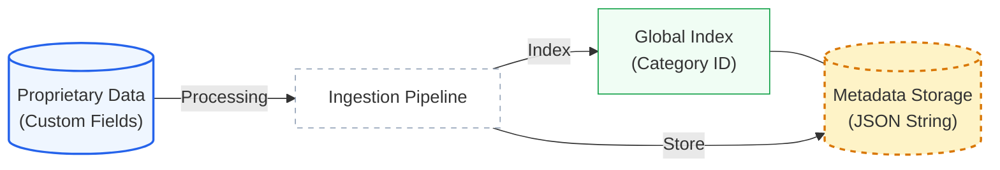
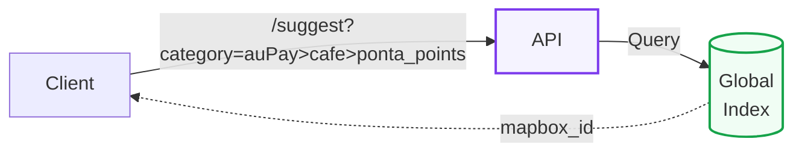
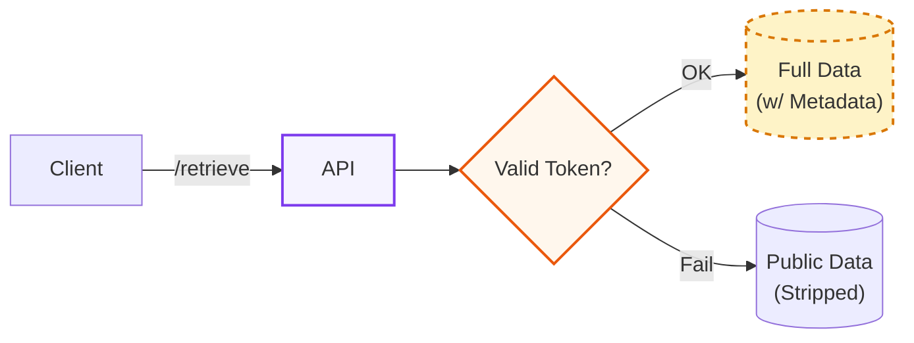

<!-- Global Styles mimicking navigation-gljs style -->

<!-- Title Slide -->

  

  <h1 class="text-6xl font-extrabold tracking-tight mb-6 text-white leading-tight">
    SearchBox API 
    BYOD Implementation
  </h1>

  

    Leveraging the Category Framework for Proprietary Data Ingestion and Search
  

  January 15, 2026

  
  |　　APJ

---
layout: default
---

  <h1 class="text-3xl text-slate-800 font-bold mb-2">Proposal Overview</h1>
  

  <h3 class="font-bold text-slate-800 mb-0.5 flex items-center gap-2">
    

 BYOD Implementation
  </h3>
  <ul class="list-disc ml-5 space-y-0.5 text-slate-600">
    <li>Leverage existing <strong>poi_category</strong> for native filtering</li>
    <li>Assign unique Canonical IDs (e.g., <code class="bg-slate-50 px-1 text-[11px]">auPay>cafe>ponta_points</code>) to customer datasets</li>
    <li>Maintains high performance using existing category indexing</li>
    <li><strong>Engineering Inquiry:</strong> Can Canonical IDs be returned conditionally for authorized proprietary tokens?</li>
  </ul>

  <h3 class="font-bold text-slate-800 mb-0.5 flex items-center gap-2">
    

 Category Management
  </h3>
  <ul class="list-disc ml-5 space-y-0.5 text-slate-600">
    <li>Utilize <code class="bg-slate-50 px-1 text-[11px]">/search/v1/list/category</code> for discovery</li>
    <li><strong>Engineering Inquiry:</strong> Can permission-based scoping be implemented for authorized proprietary tokens?</li>
  </ul>

  <h3 class="font-bold text-slate-800 mb-0.5 flex items-center gap-2">
    

 Secure Metadata
  </h3>
  <ul class="list-disc ml-5 space-y-0.5 text-slate-600">
    <li>Store proprietary data in <code class="bg-slate-50 px-1 text-[11px]">metadata</code> object</li>
    <li><strong>Engineering Inquiry:</strong> Can metadata be returned conditionally for authorized proprietary tokens?</li>
  </ul>

---
layout: default
---

  <h1 class="text-3xl text-slate-800 font-bold mb-2">System Overview</h1>
  

  <h3 class="text-2xl font-bold text-slate-700">1. Data Ingestion</h3>
  Daily Batch Job?

  

<h3 class="text-2xl font-bold text-slate-700 mb-2">2. Interactive Search</h3>

  

<h3 class="text-2xl font-bold text-slate-700 mb-2">3. Secure Retrieval</h3>

